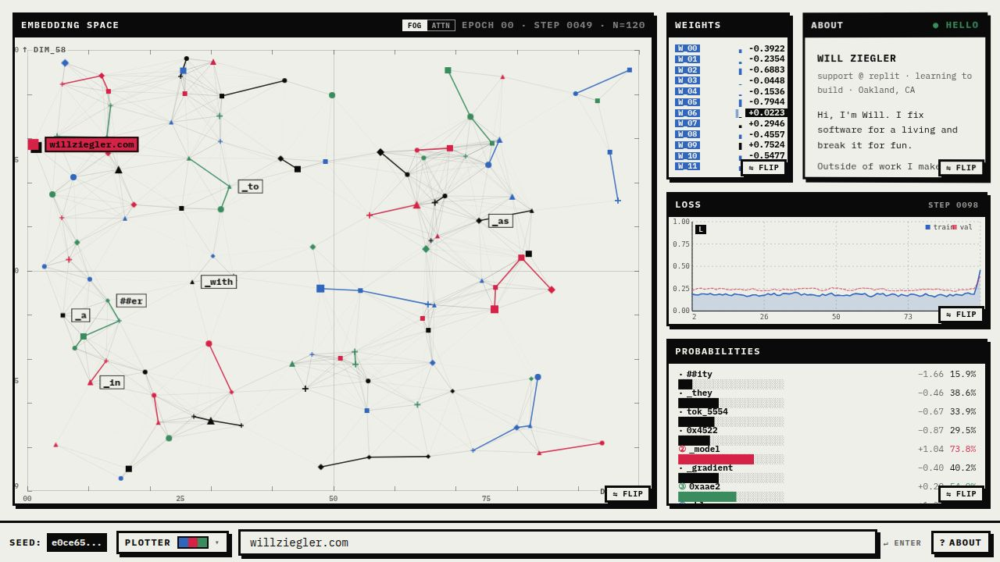

# personalsite

The source for [willziegler.com](https://willziegler.com) — a personal site featuring a live, in-browser AI dashboard.



## What's inside

- **`artifacts/retro-ai`** — the React + Vite frontend that powers the site.
- **`artifacts/api-server`** — a small backing API.
- **`artifacts/mockup-sandbox`** — a design canvas for previewing components in isolation.

## Run it locally

This is a [pnpm](https://pnpm.io/) workspace. You'll need Node 20+ and pnpm installed.

```bash
pnpm install
pnpm --filter @workspace/retro-ai dev
```

Then open the URL printed in the terminal (Vite defaults to <http://localhost:5173>).

To build everything for production:

```bash
pnpm build
```

## License

MIT
